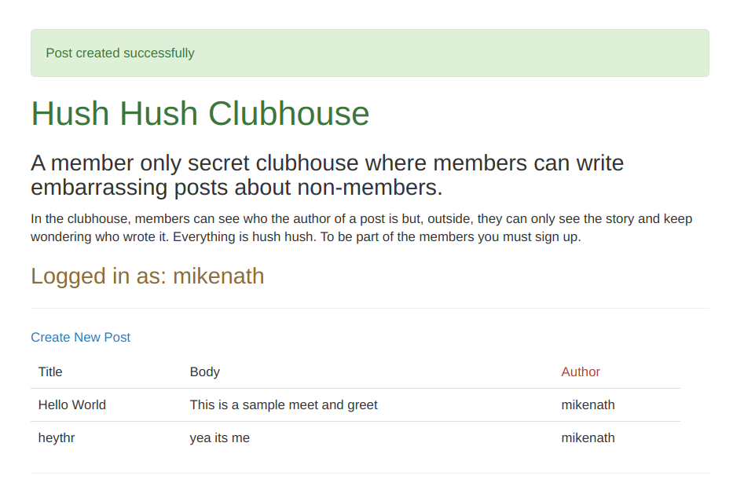

# README

## Hush Hush Clubhouse

A member only secret clubhouse where members can write embarrassing posts about non-members.
In the clubhouse, members can see who the author of a post is but, outside, they can only see the story and keep wondering who wrote it. Everything is hush hush. To be part of the members you must sign up.

## Built With

    Ruby on Rails

## Live Demo

Live Demo Link

Build with love and passion for coding :heartbeat:

# Getting Started

To get a local copy up and running follow these simple example steps.

`bundle install`
`rails db:migrate`
`rails s`

# Created by

Ukeje Michgolden  https://github.com/mikenath223 

Mario Dena https://github.com/mariodena

# Dependencies

Rails 6.0.2

Ruby 2.6.5

Yarn 1.21.1

# License

This project is [MIT](lic.url) licensed.
